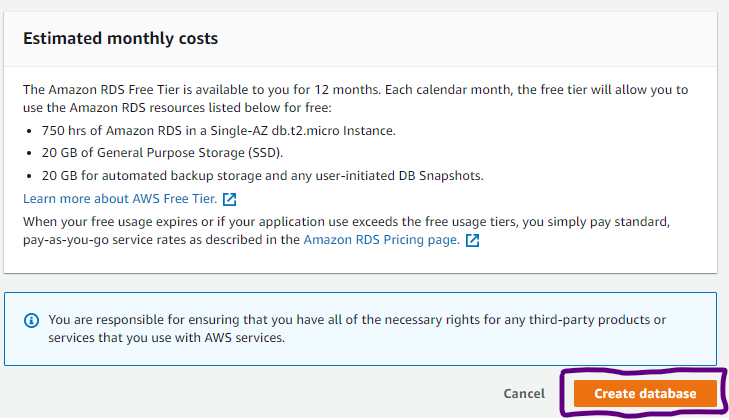

### Connecting AWS RDS with local SQL Client
## Project Description
This is a very simple project where we will work with AWS RDS. We will create a free tier eligible MySQL RDS Database Instance. We will then install a local SQL client in our local environment. We will connect the the local SQL client with the AWS RDS Database instance that we have just created. After successful creation, we will delete all the created resources.

## Follow Along:

# Part 1: Create a MySQL RDS Instance
Head over to the AWS Management Console and seach "RDS" in services. Then locate "create database" :

Choose "Standard Create" in the database creation method and in engine options let's select "MySQL" :

Since we are creating this project for practice, select "Free Tier" in templates:

Give desired credentials to create your own RDS instance:

Pay close attention to "Connectivity". Let's choose "Public Access" as "Yes". We will also create a new security group instead of the default security group.

Rest everything stay as deafault and then create the database:

After successful creation the database should be avaialble in the databases dashboard :

# Part 2: Download a Local SQL Client
We will download the MySQL Workbench in our local system if it is not installed already. Click Here to locate the installer. After successful installation, it should be available in your local system. Add a new connection by pressing the "+" button :

Head over to the AWS Management Console again and "View Credential Detail" of the RDS Instance:

Enter the following detials as shown on the following pic which I have tried to map from the AWS RDS Credential Detail to the MySQL Workbench Connection :

Test the connection, if it is successful then it should look something like this:

The connection should also appear in the MySQL Workbench dashboard from now onwards:

Double click the connection, whatever query is written here will be reflected in the AWS RDS portal:

# Delete the RDS Instance
Don't forget to delete all the RDS Instance as one can be billed after the free tier quota is over.

## Contact 
Priyanka Patel - https://www.linkedin.com/in/priyanka-patel-5088721a9/
