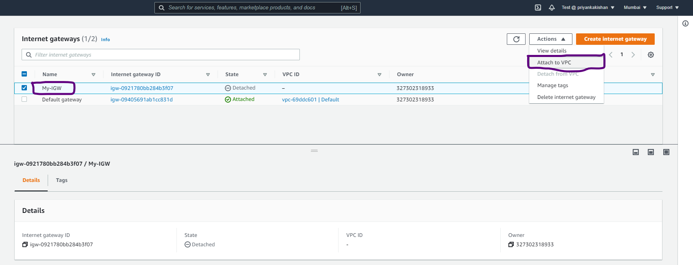
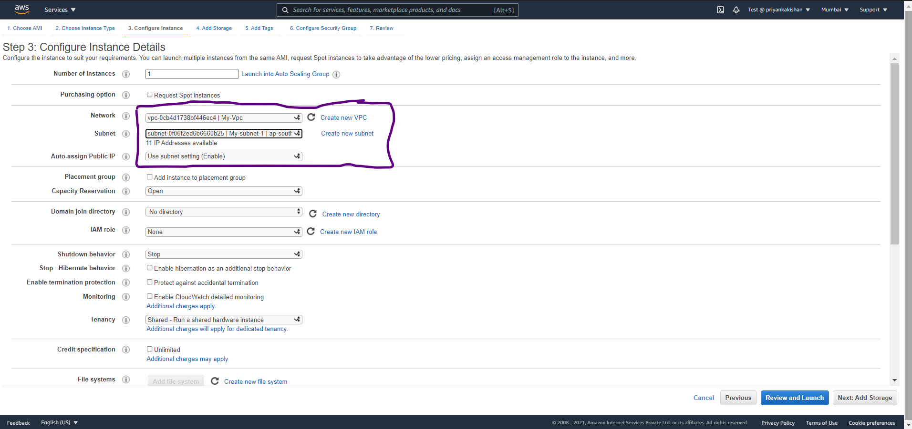

### Create Custom VPC with public and private subnet
## Project Description

In this project I have created a custom VPC in AWS. The reference architecture diagram is provided as the project logo. I have created two subnets where one is a public subnet and the other is a private subnet. The public subnet could simulate as Web Server which is the Application Tier. For maintaining security concerns, the private subnet could simulate as Database Server which is the Database Tier.

## Follow Along:

# Part 1: Designing the VPC Architecture

Create VPC in the AWS Management Console:

Create new subnets, I will create two subnets where I will make one public subnet and one private subnet. Make sure the CIDR ranges don't clash between the subnets:

Now we need to create an Internet Gateway:

After creating an Internet Gateway, we need to attach this to our Custom VPC to give our VPC internet access:

After successfully attaching this Internet Gateway to our custom VPC, the Internet Gateway State should specify as "Attached":

Now we need to create a new Route Table and we will associate this route table with the Internet Gateway:

Now we will make our Subnet 1 as our Public Subnet. To do this, select "Edit Subnet Associations" and then choose the Subnet 1 that we created earlier:

One crucial task to make any subnet as public subnet is by enabling " Auto-Assign IPv4 address". We need to ebnable this option for our Subnet 1:

# Part 2: Creating EC2 Resources to put our Application Tier and Database Tier inside our Custom VPC:
Now we can start putting resources inside our VPC. Let's assume the Application and Database Tier will be put on two different EC2 Instances. We will create two new EC2 Instances. We will put Application Tier EC2 instance in Public Sunet 1 and then we will put the Database Tier EC2 Instance in Private Subnet of our VPC:

## Contact 
Priyanka Patel - https://www.linkedin.com/in/priyanka-patel-5088721a9/
